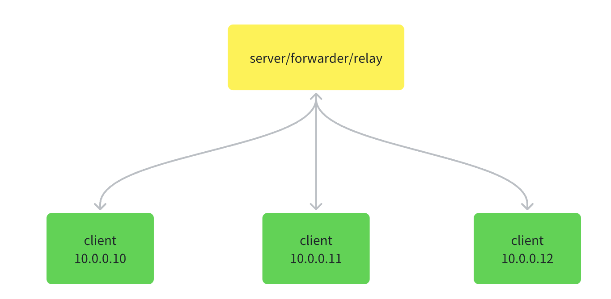

# rust tunnel

another rust version vpn tunnel.

**status: developing**



## How to

1. compile

```shell
cargo build
```

or cross compile

```shell
cross build --target x86_64-unknown-linux-gnu
```

replace x86_64-unknown-linux-gnu wiht your target arch.

2. run

```shell
[server_config]
listen_addr = "0.0.0.0:8080"

[crypto_config]
xor="rustun"

[[client_configs]]
identity = "headquarters"
private_ip = "10.0.0.2"
ciders = ["192.168.1.0/24"]

[[client_configs]]
identity = "branch_a"
private_ip = "10.0.0.3"
ciders = []     

./server etc/server.toml
```

it will:

- listen `0.0.0.0:8080`
- use xor crypto metho with key `rust_tun`
- add two clients configurations

client1: headquarters

```shell
➜  rustun git:(main) ✗ cat etc/client.toml 
[client_config]
server_addr = "192.168.1.8:8080"
identity = "headquarters"

[device_config]
private_ip = "10.0.0.2"
mask = "255.255.255.0"
gateway="10.0.0.1"

[crypto_config]
xor="rustun"

./client etc/client.toml
```

it will:

- connect server(192.168.1.8:8080)
- set the virtual private ip to **10.0.0.2**
- use xor crypto with key `rustun`


client2: branch_a

```shell
➜  rustun git:(main) ✗ cat etc/client.toml
[client_config]
server_addr = "192.168.1.8:8080"
identity = "branch_a"

[device_config]
private_ip = "10.0.0.3"
mask = "255.0.0.0"
gateway="10.0.0.1"

[crypto_config]
xor="rustun"    

./client etc/client.toml
```

it will:
- connect server(192.168.1.8:8080)
- set the virtual private ip to **10.0.0.3**
- use xor crypto with key `rustun`

3. test

**case1: branch_a ping headquarters private ip**

10.0.0.3 ping 10.0.0.2

**case2: branch_a ping client1's ciders ip**

10.0.0.3 ping 192.168.1.201

> **note**
> 
> client1 and client2 DONT run in the same machine