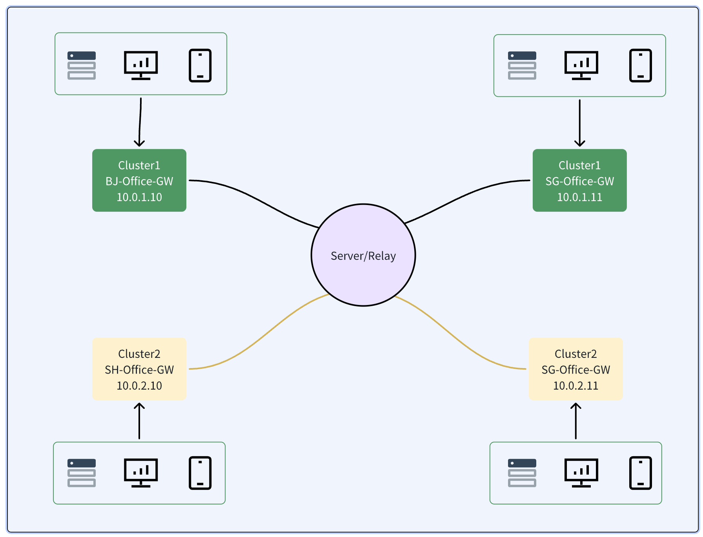

<div align="center">

<h1>🌐 Rustun</h1>

<h3>A Modern VPN Tunnel in Rust</h3>

<br/>

[](https://opensource.org/licenses/MIT)
[](https://www.rust-lang.org/)
[](https://github.com/smartethnet/rustun/actions)
[](https://github.com/smartethnet/rustun/releases)
[](https://github.com/smartethnet/rustun/releases)
[](https://github.com/smartethnet/rustun)

[🌐 Website](https://smartethnet.github.io) · [📖 Documentation](https://smartethnet.github.io) · [中文文档](./doc/README_CN.md) · [🐛 Report Bug](https://github.com/smartethnet/rustun/issues) · [✨ Request Feature](https://github.com/smartethnet/rustun/issues)

</div>

---

A high-performance VPN tunnel implementation written in Rust.

**Status: Actively Developing** 🚧



## ✨ Key Features

- 🔓 **Open Source** - MIT License, completely free and transparent
- ⚡ **Simple & Fast** - One command to start: `./client -s SERVER:8080 -i client-001`
- 🏢 **Multi-Tenant** - Cluster-based isolation for multiple teams or business units
- 🔐 **Secure Encryption** - ChaCha20-Poly1305 (default), AES-256-GCM, XOR/Plain options
- 🚀 **High Performance** - P2P direct connection with auto-fallback to relay mode
- 🌍 **Cross-Platform** - Linux, macOS, Windows with pre-built binaries

## 📋 Table of Contents

- [Quick Start](#quick-start)
  - [Prerequisites](#prerequisites)
  - [Download Pre-built Binaries](#download-pre-built-binaries)
  - [Installation](#installation)
  - [Quick Test](#quick-test)
- [Configuration](#configuration)
  - [Server Configuration](#server-configuration)
  - [Client Routes Configuration](#client-routes-configuration)
- [Usage](#usage)
  - [Starting the Server](#starting-the-server)
  - [Starting a Client](#starting-a-client)
  - [Client Command-Line Options](#client-command-line-options)
  - [Encryption Options](#encryption-options)
  - [P2P Direct Connection](#p2p-direct-connection)
  - [Example: Multi-Tenant Setup](#example-multi-tenant-setup)
- [Roadmap](#roadmap)

## 🚀 Quick Start

> **💡 Tip:** Visit our [website](https://smartethnet.github.io) for an interactive demo and visual guide!

### Prerequisites

**All Platforms:**
- TUN/TAP driver support

**Windows:**
- Download [Wintun driver](https://www.wintun.net/) (required for TUN device)
- Administrator privileges

**Linux/macOS:**
- Root/sudo privileges (or set capabilities on Linux)

### Download Pre-built Binaries

**Download from [GitHub Releases](https://github.com/smartethnet/rustun/releases/latest)**

Available for:
- **Linux** - x86_64 (glibc/musl), ARM64 (glibc/musl)
- **macOS** - Intel (x86_64), Apple Silicon (ARM64)
- **Windows** - x86_64 (MSVC)

Each release includes:
- `server` - VPN server binary
- `client` - VPN client binary
- `server.toml.example` - Configuration example
- `routes.json.example` - Routes example

### Installation

**Linux/macOS:**
```bash
# Download and extract (example for Linux x86_64)
wget https://github.com/smartethnet/rustun/releases/download/0.0.1/rustun-0.0.1-x86_64-unknown-linux-gnu.tar.gz
tar xzf rustun-0.0.1-x86_64-unknown-linux-gnu.tar.gz
cd rustun-0.0.1-x86_64-unknown-linux-gnu

# Make binaries executable
chmod +x server client
```

**Windows:**
```powershell
# 1. Download rustun-0.0.1-x86_64-pc-windows-msvc.zip from releases
# 2. Extract to a directory
# 3. Download Wintun from https://www.wintun.net/
# 4. Extract wintun.dll to the same directory as client.exe
```

### Quick Test

**Start Server:**
```bash
# Linux/macOS
sudo ./server server.toml.example

# Windows (as Administrator)
.\server.exe server.toml.example
```

**Connect Client:**
```bash
# Linux/macOS
sudo ./client -s SERVER_IP:8080 -i client-001

# Windows (as Administrator)
.\client.exe -s SERVER_IP:8080 -i client-001
```

## ⚙️ Configuration

### Server Configuration

Create `server.toml`:

```toml
[server_config]
listen_addr = "0.0.0.0:8080"

[crypto_config]
# ChaCha20-Poly1305 (Recommended)
chacha20poly1305 = "your-secret-key-here"

# Or use AES-256-GCM
# aes256 = "your-secret-key-here"

# Or XOR (lightweight)
# xor = "rustun"

# Or no encryption
# crypto_config = plain

[route_config]
routes_file = "./etc/routes.json"
```

### Client Routes Configuration

Create `routes.json`:

```json
[
  {
    "cluster": "beijing",
    "identity": "bj-office-gw",
    "private_ip": "10.0.1.1",
    "mask": "255.255.255.0",
    "gateway": "10.0.1.254",
    "ciders": ["192.168.1.0/24", "192.168.2.0/24"]
  },
  {
    "cluster": "beijing",
    "identity": "bj-dev-server",
    "private_ip": "10.0.1.2",
    "mask": "255.255.255.0",
    "gateway": "10.0.1.254",
    "ciders": []
  },
  {
    "cluster": "shanghai",
    "identity": "sh-office-gw",
    "private_ip": "10.0.2.1",
    "mask": "255.255.255.0",
    "gateway": "10.0.2.254",
    "ciders": ["192.168.10.0/24"]
  },
  {
    "cluster": "shanghai",
    "identity": "sh-db-server",
    "private_ip": "10.0.2.2",
    "mask": "255.255.255.0",
    "gateway": "10.0.2.254",
    "ciders": []
  }
]
```

**Configuration Explained:**

- `cluster`: Logical group for multi-tenancy isolation
- `identity`: Unique client identifier
- `private_ip`: Virtual IP assigned to the client
- `mask`: Subnet mask for the VPN network
- `gateway`: Gateway IP for routing
- `ciders`: CIDR ranges accessible through this client

## 📖 Usage

### Starting the Server

```bash
# With default configuration file
./server etc/server.toml

# Server will:
# - Listen on 0.0.0.0:8080
# - Use ChaCha20-Poly1305 encryption
# - Load client routes from routes.json
```

### Starting a Client

```bash
# Basic usage (uses default ChaCha20 encryption)
./client -s SERVER_IP:8080 -i CLIENT_IDENTITY

# Example: Beijing office gateway
./client -s 192.168.1.100:8080 -i bj-office-gw

# Example: Shanghai database server
./client -s 192.168.1.100:8080 -i sh-db-server
```

### Client Command-Line Options

```bash
./client --help
```

```
Rustun VPN Client

Usage: client [OPTIONS] --server <SERVER> --identity <IDENTITY>

Options:
  -s, --server <SERVER>
          Server address (e.g., 127.0.0.1:8080)

  -i, --identity <IDENTITY>
          Client identity/name

  -c, --crypto <CRYPTO>
          Encryption method: plain, aes256:<key>, chacha20:<key>, or xor:<key>
          [default: chacha20:rustun]

      --enable-p2p
          Enable P2P direct connection via IPv6
          (disabled by default, uses relay only)

      --keepalive-interval <KEEPALIVE_INTERVAL>
          Keep-alive interval in seconds
          [default: 10]

      --keepalive-threshold <KEEPALIVE_THRESHOLD>
          Keep-alive threshold (reconnect after this many failures)
          [default: 5]

  -h, --help
          Print help

  -V, --version
          Print version
```

### Encryption Options

```bash
# ChaCha20-Poly1305 (Default, Recommended)
./client -s SERVER:8080 -i client-001 -c chacha20:my-secret-key

# AES-256-GCM (Hardware accelerated on supported CPUs)
./client -s SERVER:8080 -i client-001 -c aes256:my-secret-key

# XOR (Lightweight, for testing only)
./client -s SERVER:8080 -i client-001 -c xor:test-key

# Plain (No encryption, debugging only)
./client -s SERVER:8080 -i client-001 -c plain
```

### P2P Direct Connection

By default, all traffic goes through the relay server. Enable P2P for direct IPv6 connections between clients:

```bash
# Enable P2P direct connection
./client -s SERVER:8080 -i client-001 --enable-p2p
```

**P2P Benefits:**
- 🚀 Lower latency (direct peer-to-peer)
- 📉 Reduced server bandwidth usage
- ⚡ Automatic fallback to relay if P2P fails

**Requirements:**
- Both clients must have IPv6 connectivity
- Both clients must use `--enable-p2p` flag
- UDP port 51258 must be accessible

**How it works:**
1. Clients exchange IPv6 addresses via server
2. Keepalive packets establish direct connection
3. Data sent via P2P when connection is active
4. Automatic fallback to relay if P2P fails

### Example: Multi-Tenant Setup

#### Scenario: Two Offices (Beijing & Shanghai)

**Beijing Cluster:**
- Office Gateway: `bj-office-gw` (10.0.1.1)
- Dev Server: `bj-dev-server` (10.0.1.2)

**Shanghai Cluster:**
- Office Gateway: `sh-office-gw` (10.0.2.1)
- DB Server: `sh-db-server` (10.0.2.2)

**Start Server:**
```bash
./server etc/server.toml
```

**Connect Beijing Clients:**
```bash
# Terminal 1: Beijing Office Gateway
./client -s 192.168.1.100:8080 -i bj-office-gw

# Terminal 2: Beijing Dev Server
./client -s 192.168.1.100:8080 -i bj-dev-server
```

**Connect Shanghai Clients:**
```bash
# Terminal 3: Shanghai Office Gateway
./client -s 192.168.1.100:8080 -i sh-office-gw

# Terminal 4: Shanghai DB Server
./client -s 192.168.1.100:8080 -i sh-db-server
```

**Test Connectivity:**

```bash
# Beijing clients can communicate
ping 10.0.1.2  # From bj-office-gw to bj-dev-server

# Shanghai clients can communicate
ping 10.0.2.2  # From sh-office-gw to sh-db-server

# Cross-cluster communication is isolated
# Beijing cannot reach Shanghai and vice versa
```

## 🗺️ Roadmap

- [x] **IPv6 support** - ✅ Completed
- [x] **P2P direct connection** - ✅ Completed (IPv6 P2P with auto fallback)
- [ ] Windows service support
- [ ] systemd integration for Linux
- [ ] Web-based management dashboard
- [ ] Dynamic route updates without restart
- [ ] QUIC protocol support
- [ ] Mobile clients (iOS/Android)
- [ ] Docker container images
- [ ] Kubernetes operator
- [ ] Auto-update mechanism

## 🙏 Acknowledgments

- Built with [Tokio](https://tokio.rs/) async runtime
- Encryption by [RustCrypto](https://github.com/RustCrypto)
- TUN/TAP interface via [tun-rs](https://github.com/meh/rust-tun)

## 📞 Contact

- Issues: [GitHub Issues](https://github.com/smartethnet/rustun/issues)
- Discussions: [GitHub Discussions](https://github.com/smartethnet/rustun/discussions)

---

**Note**: This is an experimental project. Use at your own risk in production environments.
