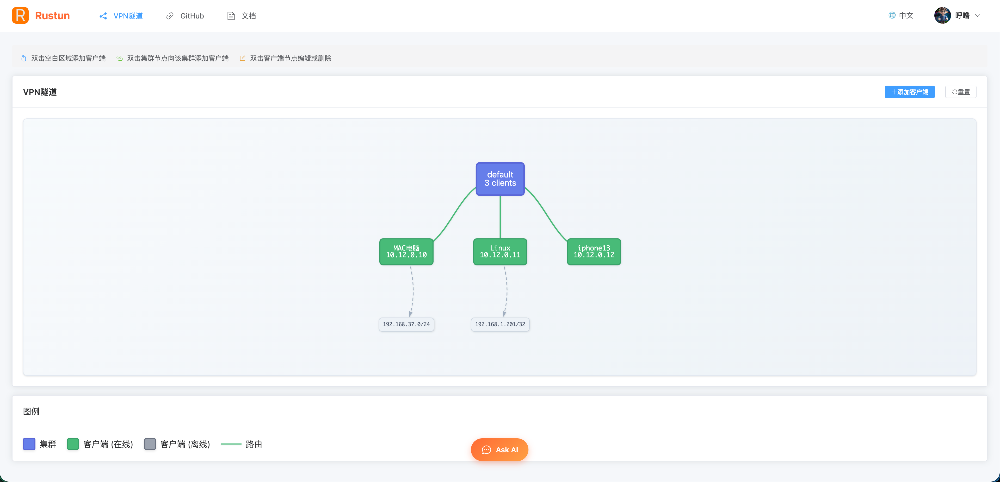

<div align="center">

<h1>🌐 Rustun</h1>

<h3>AI-Driven Intelligent VPN Tunnel</h3>

<br/>

[](https://opensource.org/licenses/MIT)
[](https://www.rust-lang.org/)
[](https://github.com/smartethnet/rustun/actions)
[](https://github.com/smartethnet/rustun/releases)
[](https://github.com/smartethnet/rustun/releases)
[](https://github.com/smartethnet/rustun)

[🌐 Website](https://smartethnet.github.io) · [中文文档](./doc/README_CN.md) · [🐛 Issues](https://github.com/smartethnet/rustun/issues)

[](https://github.com/smartethnet/rustun-apple)
[](https://github.com/smartethnet/rustun-apple)
[](https://github.com/smartethnet/rustun-android)
[](https://github.com/smartethnet/rustun-desktop)
[](https://github.com/smartethnet/rustun)

</div>

---

**Status: Beta** 🚧

An AI-driven VPN tunnel written in Rust with automatic path selection: IPv6 direct → STUN hole punching → relay fallback.

## ✨ Features

- **Dual-Path P2P** — IPv6 direct + STUN hole punching with auto-fallback to relay
- **Smart Routing** — automatic path selection, no manual configuration needed
- **Multi-Tenant** — cluster-based isolation for teams and environments
- **Encryption** — ChaCha20-Poly1305 (default), AES-256-GCM, XOR
- **CIDR Mapping** — resolve overlapping subnets (Linux only)
- **Cross-Platform** — Linux, macOS, Windows

## 🚀 Quick Start

### Server (one-click install)

```bash
curl -fsSL https://raw.githubusercontent.com/smartethnet/rustun/main/install.sh | sudo bash
sudo vim /etc/rustun/server.toml
sudo vim /etc/rustun/routes.json
sudo systemctl enable --now rustun-server
```

### Client

```bash
sudo ./client -s SERVER_IP:8080 -i client-identity
```

### Try the Demo Server

1. Login at [rustun.beyondnetwork.cn](https://rustun.beyondnetwork.cn) and create a client identity
2. Download the binary from [GitHub Releases](https://github.com/smartethnet/rustun/releases/latest)
3. Connect:
   ```bash
   sudo ./client -s rustun.demo.beyondnetwork.cn:18080 -i <your-identity> -c xor:rustun@smartethnet.github.io
   ```

**Mobile:** [iOS/macOS TestFlight](https://testflight.apple.com/join/2zf3dwxH)



## 📚 Documentation

| Topic | File |
|-------|------|
| Configuration (server.toml, routes.json, multi-tenant) | [doc/CONFIGURATION.md](./doc/CONFIGURATION.md) |
| Usage (client options, encryption, P2P, Windows) | [doc/USAGE.md](./doc/USAGE.md) |
| Build from source & cross-compilation | [BUILD.md](./BUILD.md) |
| Protocol & architecture | [PROTOCOL.md](./PROTOCOL.md) |
| Contributing | [CONTRIBUTING.md](./CONTRIBUTING.md) |

## 🗺️ Roadmap

- [x] IPv6 P2P direct connection
- [x] STUN hole punching (NAT traversal)
- [x] Dual-path networking with intelligent failover
- [x] Real-time connection monitoring
- [x] Dynamic route updates (no restart needed)
- [x] Web-based management dashboard
- [x] Mobile & Desktop clients (Android/iOS/Windows/macOS)
- [ ] QUIC protocol support
- [ ] Docker images & Kubernetes operator
- [ ] Windows service support
- [ ] Auto-update mechanism

## 👥 Contributors

Thanks to everyone who has contributed to Rustun!

[](https://github.com/smartethnet/rustun/graphs/contributors)

Contributions are welcome — see [CONTRIBUTING.md](./CONTRIBUTING.md) to get started.

## 🙏 Acknowledgments

Built with [Tokio](https://tokio.rs/), [RustCrypto](https://github.com/RustCrypto), and [tun-rs](https://github.com/meh/rust-tun).

---

> **Note:** This is an experimental project. Use at your own risk in production.
